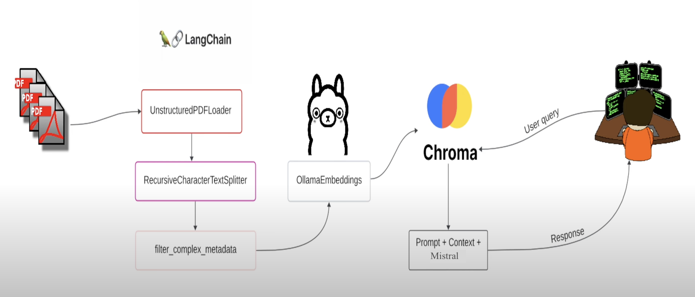

# Local Retrieval Augmented Generation (RAG)
# PDF Content Analyzer: Q&A system

Welcome to the PDF Content Analyzer, a Python application that utilizes natural language processing to analyze and answer questions from a PDF document. The project here is significantly-inspired by [Greg Kamradt](https://community.fullstackretrieval.com/)'s amazing Retrieval videos and [Tony Kipkemboi]'s (https://www.youtube.com/@tonykipkemboi) efficient implementation videos.

This project leverages the LangChain framework & the built-in libraries to facilitate document loading, text processing, embedding generation, and querying capabilities as well as open-source Large Language Models for natural human like responses.

The Final Poster can be found in the presentations folder along with the proposal, design, and results of this project.

## Application Architecture

Below is a diagram of the application architecture, illustrating how the components interact:



The diagram shows the workflow from loading the PDF to extracting responses based on user queries.


## Prerequisites

Before you begin, ensure you have the following installed on your machine:
- Python 3.8 or higher
- pip (Python package installer)
- Git

## Installation

Follow these steps to get your environment set up:

### 1. Clone the Repository

First, clone this repository to your local machine using Git:

```bash
git clone https://github.com/JYF19/COMP401_Spr2024.git
cd COMP401_Spr2024/main
```

### 2. Virtual Environment (Optional but Recommended)

It's a good practice to use a virtual environment to manage dependencies. Here's how you can set it up:

```bash
# Install virtualenv if you don't have it
pip install virtualenv

# Create a virtual environment
virtualenv venv

# Activate the virtual environment
# On Windows
venv\Scripts\activate
# On MacOS/Linux
source venv/bin/activate
```

### 3. Install Dependencies

Install the required Python libraries:

```bash
pip install unstructured langchain langchain-community chromadb langchain-text-splitters
```

## Installing Language Models

This project uses the Llama and Mistral language models from the LangChain and Hugging Face ecosystems. Follow these steps to ensure these language models are properly installed and configured.

### Llama Models

1. **Hugging Face Account**:
   First, if you haven't already, you need to create an account on Hugging Face to access models. You can sign up here: [Hugging Face](https://huggingface.co/join).

2. **Hugging Face Transformers Library**:
   Install the Hugging Face Transformers library, which provides the infrastructure to download and use Llama models.

   ```bash
   pip install transformers
   ```

3. **Model Setup**:
   The Llama models can be used directly via the Transformers library. Ensure you have internet access the first time you run the model so it can download the necessary files.

### Mistral Models

Mistral is part of the LangChain language models. Follow these steps to set it up:

1. **Install LangChain**:
   You have already installed LangChain if you followed the initial setup instructions. If not, please run:

   ```bash
   pip install langchain
   ```

2. **Model Configuration**:
   Mistral models are accessed via the LangChain framework. Ensure your `langchain` configuration is set to use Mistral by setting up the appropriate environment variables or configuration files as described in the LangChain documentation.

### Model Integration

Ensure that your application's configuration files or environment settings are pointing to the correct models. For Llama, specify the model ID when initializing it in your code. For Mistral, check the LangChain configuration.

Example of initializing a model in your Python script:

```python
from transformers import AutoModelForCausalLM, AutoTokenizer

# For using Llama model
model_name = "allenai/llama"
tokenizer = AutoTokenizer.from_pretrained(model_name)
model = AutoModelForCausalLM.from_pretrained(model_name)

# For using Mistral model (simplified, depends on your setup)
from langchain.llms import Mistral
mistral_model = Mistral()
```

### Testing the Models

After installation, it's a good idea to test the models with simple scripts to ensure they are properly loaded and functioning:

```python
# Testing Llama
input_text = "Hello, world!"
encoded_input = tokenizer(input_text, return_tensors="pt")
output = model.generate(**encoded_input)
print(tokenizer.decode(output[0]))

# Testing Mistral
response = mistral_model.generate("Hello, world!")
print(response)
```

By testing the models, you ensure that they are ready to be integrated into your larger application workflow.

## Troubleshooting

If you encounter issues with model installations, such as download errors or compatibility issues, consult the official documentation of Hugging Face Transformers and LangChain. You can also reach out to their respective support forums or communities for help.
```

## Usage

Once you've installed all the required software and libraries, you're ready to run the application.

### Running the Application

1. **Start the Application**:
   Execute the `main.py` script from your terminal. Make sure your virtual environment is activated if you are using one.

   ```bash
   python main.py
   ```

2. **Input the PDF File Path**:
   When prompted, enter the full path to the PDF file you wish to analyze.

3. **Ask a Question**:
   After the PDF is processed, the system will prompt you to enter a question. Type your question and press Enter.

4. **Receive Your Answer**:
   The system will process your question and return an answer based on the content of the PDF.

### Example Interaction

```plaintext
Please enter the path to the PDF file you want to analyze: C:\Users\JohnDoe\Documents\example.pdf
Enter your question: What are the main topics discussed in the document?
Processing... please wait.
The main topics discussed are...
```

## Architecture Overview

This application is structured into several modules, each handling a specific part of the process:

- `load_pdf.py`: Manages the loading of PDF files.
- `text_processing.py`: Handles the splitting and cleaning of text data.
- `embeddings.py`: Responsible for generating embeddings from text.
- `query_processing.py`: Manages the creation and processing of queries.
- `response_handling.py`: Formats and displays responses.

## Contributing

We welcome contributions to this project! If you have suggestions or improvements, feel free to fork this repository and submit a pull request.

## License

This project is licensed under the MIT License - see the [LICENSE](LICENSE) file for details.

## Acknowledgments

This project uses several open-source packages:
- [LangChain](https://github.com/hwchase17/langchain)
- [Unstructured](https://github.com/Unstructured-IO/unstructured)
- [ChromaDB](https://github.com/chroma-core/chroma)
- [Hugging Face Transformers](https://huggingface.co/transformers/)

Thank you to all the contributors of these projects!
